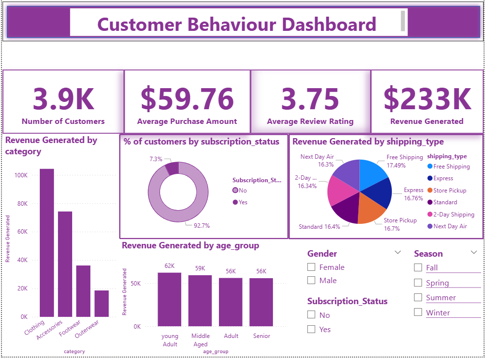

# Customer-Behaviour-Analysis
End-to-end customer shopping behavior analysis using Python, SQL, and Power BI — covering data cleaning, segmentation, revenue trends, and an interactive dashboard.

# 🛍️ Customer Shopping Behavior Analysis

An end-to-end data analysis project exploring customer shopping patterns using **Python**, **MS SQL Server**, and **Power BI**.

---

## 📌 Project Overview

This project analyzes transactional data from **3,900 customer purchases** across various product categories to uncover insights into spending patterns, customer segmentation, product preferences, discount behavior, and subscription trends — all aimed at supporting data-driven business decisions.

---

## 📁 Project Structure

```
├── sales_analysis.ipynb       # Python notebook: EDA, cleaning, feature engineering & SQL export
├── Queries_answered.sql       # MS SQL queries answering 10 business questions
├── dashboard/                 # Power BI dashboard file (.pbix)
└── README.md
```

---

## 📊 Dataset

| Property | Details |
|---|---|
| Rows | 3,900 |
| Columns | 18 (expanded to 20 after feature engineering) |
| Source | `customer_shopping_behavior.csv` |
| Missing Data | 37 null values in `Review Rating` |

**Key columns:** `customer_id`, `age`, `gender`, `item_purchased`, `category`, `purchase_amount`, `location`, `season`, `review_rating`, `subscription_status`, `shipping_type`, `discount_applied`, `previous_purchases`, `payment_method`, `frequency_of_purchases`

---

## 🐍 Python — EDA & Data Preparation (`sales_analysis.ipynb`)

- **Libraries used:** `pandas`, `numpy`, `matplotlib`, `seaborn`, `sqlalchemy`, `pyodbc`
- Loaded and explored the dataset using `df.info()` and `df.describe()`
- Imputed 37 missing `review_rating` values using **median per product category**
- Renamed all columns to **snake_case** for consistency
- **Feature Engineering:**
  - `age_group` — binned customer ages into Young Adult, Middle-Aged, Adult, Senior
  - `purchase_frequency_days` — numeric representation of purchase frequency
- Verified redundancy between `discount_applied` and `promo_code_used`
- Exported cleaned DataFrame to **MS SQL Server** using SQLAlchemy

---

## 🗄️ SQL Analysis (`Queries_answered.sql`)

10 business questions answered using MS SQL Server:

| # | Question |
|---|---|
| 1 | Total revenue by gender |
| 2 | High-spending customers who used discounts |
| 3 | Top 5 products by average review rating |
| 4 | Average purchase amount: Standard vs. Express shipping |
| 5 | Subscribers vs. non-subscribers: avg spend & total revenue |
| 6 | Top 5 discount-dependent products |
| 7 | Customer segmentation: New, Returning, Loyal |
| 8 | Top 3 most purchased products per category |
| 9 | Repeat buyers (>5 purchases) and subscription likelihood |
| 10 | Revenue contribution by age group |

---

## 📈 Power BI Dashboard

An interactive dashboard was built with the following visuals:

- KPI cards — Total customers, average purchase amount, average rating, total revenue
- Revenue by category (bar chart)
- Revenue by age group (bar chart)
- Subscription status distribution (donut chart)
- Revenue by shipping type (pie chart)
- Slicers for Gender, Season, Subscription Status

---

## 🔍 Key Findings

- **Male customers** generated significantly more revenue (~$157K) than female customers (~$75K)
- **839 customers** used discounts but still spent above the average purchase amount
- **Gloves** had the highest average review rating (3.86), followed by Sandals and Boots
- **Express shipping** users had a slightly higher average spend ($60.48) vs. Standard ($58.46)
- Subscribers and non-subscribers had nearly **identical average spend** (~$59.49 vs. $59.87)
- **Hat** had the highest discount rate (50%), followed by Sneakers and Coat
- **80%** of customers (3,116) were classified as Loyal
- **Young Adults** contributed the most revenue (~$62K)

---

## 💡 Business Recommendations

- **Boost Subscriptions** — Introduce exclusive perks to increase the 7.3% subscriber share
- **Loyalty Programs** — Reward repeat buyers to retain the large Loyal segment
- **Review Discount Policy** — High discount rates on items like Hats and Sneakers may be eroding margins
- **Product Positioning** — Promote top-rated items (Gloves, Sandals, Boots) more prominently
- **Targeted Marketing** — Focus campaigns on Young Adult and Middle-Aged segments and Express shipping users

---

## 🛠️ Tech Stack


---

## 🚀 How to Run

1. Clone the repository
2.Dataset is already included in the repository
3. Open and run `sales_analysis.ipynb` in Jupyter Notebook
4. Update the SQL Server connection string in the notebook (`server`, `database`)
5. Run `Queries_answered.sql` in MS SQL Server Management Studio
6. Open the Power BI `.pbix` file to explore the dashboard


